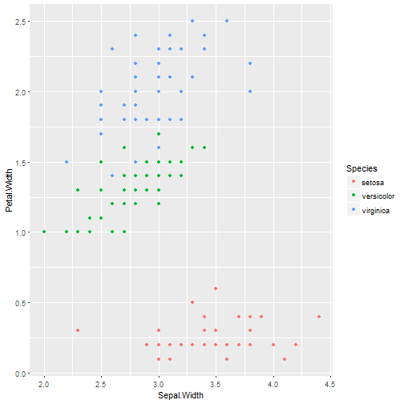

K-means App Pitch
========================================================
author: Pablo Rodriguez
date: May 6, 2018
autosize: true

Intro
========================================================

When using K-Means we must specify the number of clusters

This small app shows the effect on the mispecification.


The data
========================================================

In order to show the effect of mispecifying the number of clusters we use the classical Iris dataset

```r
data(iris)
table(iris$Species)
```

```

    setosa versicolor  virginica 
        50         50         50 
```

Why is it useful?
========================================================

Since we know the the true number of classes, it is didactic to show what happens when we mispecify it. We chose the following dimensions since they show a clear separation of the true classes.



Thanks
========================================================

Source 

https://github.com/sifogrante/DataProdsW4
